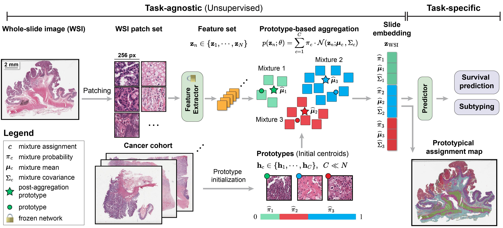
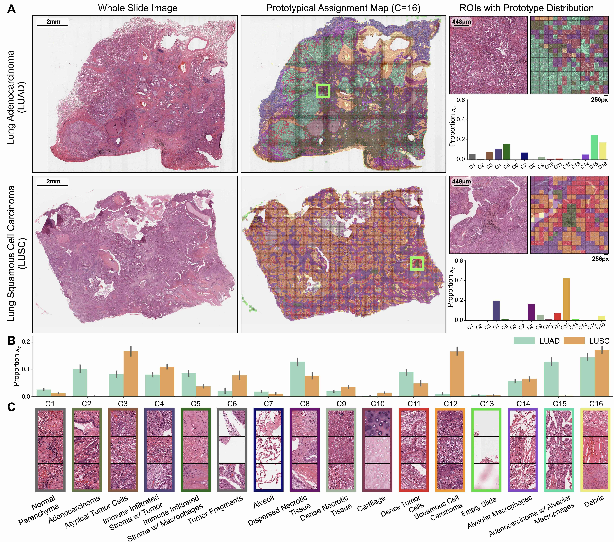

# PANTHER


  <b>Morphological Prototyping for Unsupervised Slide Representation Learning in Computational Pathology</b>, CVPR 2024.
	<br><em>Andrew H. Song\*, Richard J. Chen\*, Tong Ding, Drew F.K. Williamson, Guillaume Jaume, Faisal Mahmood</em></br>


[Arxiv](https://arxiv.org/pdf/2405.11643) | [Cite](#cite)

**Abstract:** Representation learning of pathology whole-slide images (WSIs) has been has primarily relied on weak supervision with Multiple Instance Learning (MIL). However, the slide representations resulting from this approach are highly tailored to specific clinical tasks, which limits their expressivity and generalization, particularly in scenarios with limited data. Instead, we hypothesize that morphological redundancy in tissue can be leveraged to build a task-agnostic slide representation in an unsupervised fashion. To this end, we introduce **PANTHER**, a prototype-based approach rooted in the Gaussian mixture model that summarizes the set of WSI patches into a much smaller set of morphological prototypes. Specifically, each patch is assumed to have been generated from a mixture distribution, where each mixture component represents a morphological exemplar. Utilizing the estimated mixture parameters, we then construct a compact slide representation that can be readily used for a wide range of downstream tasks.
By performing an extensive evaluation of **PANTHER** on subtyping and survival tasks using 13 datasets, we show that 1) **PANTHER** outperforms or is on par with supervised MIL baselines and 2) the analysis of morphological prototypes brings new qualitative and quantitative insights into model interpretability.




## Updates
- 07/02/2024: Multimodal extension of PANTHER ([MMP](https://github.com/mahmoodlab/MMP)) codebase is now live.
- 05/06/2024: The first version of PANTHER codebase is now live.

## Installation
Please run the following command to create PANTHER conda environment.
```shell
conda env create -f environment.yml
```

## PANTHER Walkthrough
There are two workflows for PANTHER, depending on the use case.
- **Workflow 1** 
	- Step 0 ⇒ Step 1 ⇒ Step 2A ⇒ (Step 3)
	- Useful for constructing *unsupervised* slide representations, without any specific downstream tasks at hand.
- **Workflow 2**
	- Step 0 ⇒ Step 1 ⇒ Step 2B ⇒ (Step 3)
	- Useful for when there is a specific downstream task at hand. The slide representations will be constructed. 

### Step 0. Dataset organization
**Data csv**: The data csv files (with appropriate splits, e.g., train, test) are placed within `src/splits` with appropriate folder structure. For example, for classification task on ebrains, we would have
```bash
splits/
	├── ebrains
    		├── train.csv
    		├── val.csv
    		└── test.csv
```

Alternatively, for 5-fold cross-validation survival task on TCGA BRCA, we would have
```bash
splits/
	├── TCGA_BRCA_survival_k=0
    		├── train.csv
    		├── val.csv
    		└── test.csv
	├── ...

        ├── TCGA_BRCA_survival_k=4
    		├── train.csv
    		├── val.csv
    		└── test.csv
```

**Patch features**: For the following steps, we assume that features for each patch have already been extracted and that each WSI is represented as a set of patch features. For examples of patch feature extraction, please refer to [CLAM](https://github.com/mahmoodlab/CLAM). 

The code assumes that the features are either in `.h5` or `.pt` formats - the feature directory path `FEAT_DIR` has to end with the directory `feats_h5/` if the features are in `.h5` format, and `feats_pt/` for `.pt` format.


### Step 1. Prototype construction
For prototype construction, we use K-means clustering across all training WSIs. We recommend using GPU-based FAISS when using large number of patch features for clustering. For example, we can use the following command to find 16 prototypes (of 1,024 dimension each) using FAISS from WSIs corresponding to `SPLIT_DIR/train.csv`.
```shell
CUDA_VISIBLE_DEVICES=0 python -m training.main_prototype \
--mode faiss \
--data_source FEAT_DIR_1,FEAT_DIR_2 \
--split_dir SPLIT_DIR \
--split_names train \
--in_dim 1024 \
--n_proto_patches 1000000 \
--n_proto 16 \
--n_init 5 \
--seed 1 \
--num_workers 10 \
```
The list of parameters is as follows:
- `mode`: 'faiss' uses GPU-enabled K-means clustering to find the prototypes. 'kmeans' uses sklearn K-means clustering on CPU ('faiss' or 'kmeans').
- `in_dim`: Dimension of the patch features, dependent on the feature encoder.
- `n_proto`: Number of prototypes.
- `n_proto_patches`: Number of patch features to use per prototype. In total, `n_proto * n_proto_patches` features are used for finding prototypes.
- `n_init`: Number of K-means initializations to try.

The prototypes will be saved in the `SPLIT_DIR/prototypes` folder.


A concrete script example of using TCGA-BRCA patch features can be found below. 
```shell
cd src
./scripts/prototype/brca.sh 0
```
This will initiate the script `scripts/prototype/clustering.sh` for K-means clustering. Detailed explanations for clustering hyperparameters can be found in **clustering.sh**. 

### Step 2A. Unsupervised slide representation construction
Once the prototypes are constructed, we can use **PANTHER** or **OT** to construct unsupervised slide representations.
```shell
cd src
./scripts/embedding/brca.sh 0 panther
``` 
This step will create two files in the `SPLIT_DIR/embeddings` folder: 1) **(\*.pkl)** original slide-level representation and 2) **(\*_tokenized.pkl)** slide-level representation tokenized into each prototype and statistics (e.g., mixture probability, mean, cov). Note that for **OT**, mixture probability is uniform and `cov=None`.

Alternatively, if you want to construct slide representations as part of a classification or survival downstream task, you can skip Step 2A and go straight to Step 2B.


### Step 2B. Training downstream model
Once the prototypes are constructed in Step 1 (Step 2A is not required), we can run a downstream task
```shell
cd src
./scripts/survival/brca_surv.sh 0 panther
``` 

### Step 3. Visualization

To visualize GMM mixture proportions in prototypical assignment maps in PANTHER, see the accompanying [notebook](src/visualization/prototypical_assignment_map_visualization.ipynb).



## Additional Findings in PANTHER
- We observe that using high-quality pretrained ROI encoders (such as UNI) leads to significant performances across all MIL and set-based learning methods (see the **Supplement**). Specifically:
- - When using Resnet-50 (ImageNet Transfer) and CTransPath features, unsupervised set representation methods such as OT and PANTHER underperform MIL methods (using the same features). With UNI features, OT and PANTHER can readily outperform MIL, and should be considered strong baselines when evaluating slide-level tasks.
- - DeepAttnMISL with UNI features becomes a strong MIL baseline. This can be attributed to DeepAttnMISL dependent on K-Means for cluster pooling (which depends on high-quality representations).
- - With unsupervised slide representations extracted per WSI (via OT or PANTHER), training survival models on WSIs is now much more stable since you can directly use Cox loss (instead of NLL). Across all of our ablation experiments, PANTHER with UNI features always achieved C-Index > 0.6.
  
## PANTHER Limitations
As unsupervised slide representations in PANTHER are created using non-parametric techniques such as K-Means Clustering and GMMs (which rely on Euclidean distance or dot product to compare embeddings), we note the following limitations:
- Dependent on the degree of dataset shift between the train and test distributions (due to variable H&E stain variability, known as image acquisition shift), prototype assignment for certain WSIs may lead to results in which all patches are assigned to a single prototype. This is exemplified in TCGA which has site-specific biases, and is thus an important consideration when considering using PANTHER (or any non-parametric approach) for histopathologic biomarker discovery.
- When clustering over a WSI dataset composed of millions to billions of patches, clustering with only `C=16` clusters will likely underfit the dataset, and also lead to collapse of all patches in a WSI falling under a single prototype. Empirically, we found `C=16` to outperform `C=32` in supervised settings. However, in settings such as biomarker discovery or unsupervised tissue segmentation, using more prototypes may improve performance.

## Acknowledgements
If you find our work useful in your research or if you use parts of this code please cite our paper:

```bibtext
@inproceedings{song2024morphological,
    title={Morphological Prototyping for Unsupervised Slide Representation Learning in Computational Pathology},
    author={Song, Andrew H and Chen, Richard J and Ding, Tong and Williamson, Drew FK and Jaume, Guillaume and Mahmood, Faisal},
    booktitle={Proceedings of the IEEE/CVF Conference on Computer Vision and Pattern Recognition},
    year={2024},
}
```

The code for **PANTHER** was adapted and inspired by the fantastic works of [DIEM](https://openreview.net/forum?id=MXdFBmHT4C), [OTK](https://openreview.net/forum?id=ZK6vTvb84s), and [CLAM](https://github.com/mahmoodlab/CLAM). Boilerplate code for setting up supervised MIL benchmarks was developed by Ming Y. Lu.

## Issues 
- Please open new threads or report issues directly (for urgent blockers) to `asong@bwh.harvard.edu`.
- Immediate response to minor issues may not be available.

 
